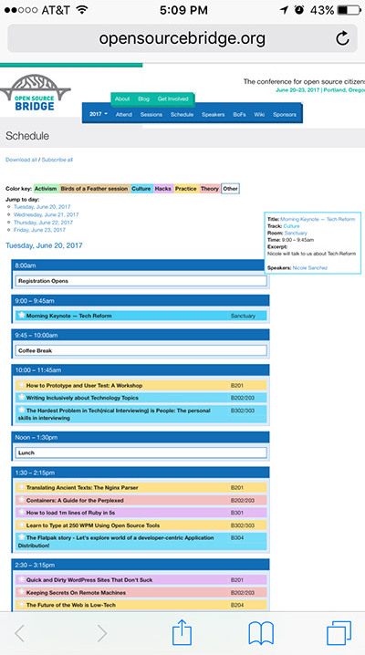
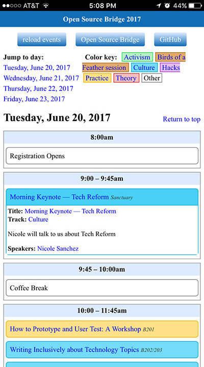

# MobileOSB
Mobile-friendlier Open Source Bridge calendar

http://osb.pdxstuff.com/ (http://strangeways.github.io/MobileOSB/)

The official Open Source Bridge website is at http://opensourcebridge.org/events/2017/schedule

**Note: The Open Source Bridge conference has ended, so these links no longer show any content.**

Previously, the Open Source Bridge calendar was not very mobile-friendly, so this was an attempt to quickly provide an alternative that loaded and displayed the calendar HTML from the Open Source Bridge site but with custom CSS applied.

## Screenshots

### Before:

### After:

